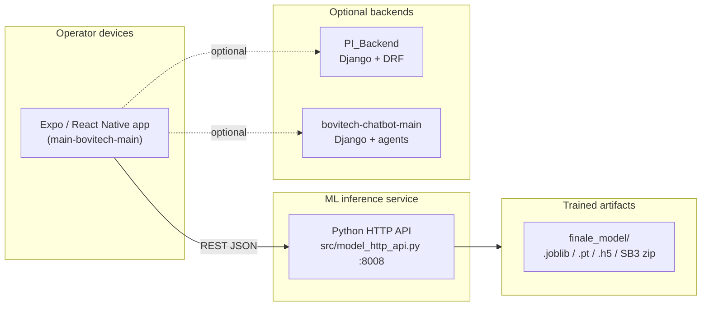

# Bovitech — Multimodal Smart Cattle Monitoring

**Bovitech** is a research-grade, multimodal decision-support stack for intelligent cattle monitoring. It combines **wearable IMU signals**, **barn environment**, **acoustics**, and **herd context** to support behavior understanding, stress awareness, production tracking, and early health signals. The system mixes classical ML, deep learning, and reinforcement learning depending on the modality.

This project was developed as part of an academic program at **[ESPRIT School of Engineering](https://esprit.tn/)** (Tunisia).

---

## Why this repository matters

- **End-to-end scope**: from tabular sensor pipelines and trained artifacts to a **mobile operator UI** and a **lightweight HTTP inference service** usable on a farm PC or edge device.
- **Multimodal by design**: behavior, milk, stress, vocalization, and fused “illness / early-warning” states are wired behind a single, documented API surface.
- **Explainability where it counts**: the illness pathway integrates SHAP-style explanations so predictions are reviewable, not black-box alerts.

---

## Capabilities

| Area | What it does | Typical technique |
|------|----------------|-------------------|
| **Behavior** | Second-level activity classes from collar (and fused) sensor features | Random Forest (multimodal-ready pipeline) |
| **Acoustics** | Bovine vocalization classification from recorded audio | CNN on Mel-spectrogram–like input (Keras `.h5`) |
| **Stress** | Risk classes from THI, core body temperature, lying/rest proxies | PyTorch sequence model (`StressDetectionV3`) |
| **Milk** | Daily yield estimate from behavior + history-style features | XGBoost + sklearn preprocessing pipeline |
| **Health / early warning** | Three-way state: healthy, at-risk, ill — plus temporal health score | PPO (Stable-Baselines3) + SHAP explanations |
| **Simulation / demo** | Tick-based simulation and barn sensor ingest for demos | Built into the inference server |

Behavior classes supported in production mapping include: *Walking, Standing, Feeding (head up / down), Licking, Drinking, Lying* (see `BEHAVIOR_LABELS` in `src/model_http_api.py`).

---

## High-level architecture



---

## Repository layout

| Path | Role |
|------|------|
| `src/model_http_api.py` | **Main inference server** (stdlib `ThreadingHTTPServer`): `/health`, `/predict/*`, `/simulate/tick`, `/barn_sensor` |
| `src/train_model.py`, `src/predict_behavior.py`, `src/pipeline_utils.py` | IMMU → per-second features → train / predict behavior |
| `src/stress_v3_model.py`, `stress_sensor/` | Stress model training / evaluation tooling |
| `src/vocal_preprocess.py` | Audio decoding (incl. ffmpeg), features for vocal CNN |
| `src/build_rl_state.py`, `src/illness/` | Fused state vector + PPO policy + SHAP explainer + health score |
| `src/dashboard_app.py` | Streamlit-style analytics entry point (when used) |
| `finale_model/` | Checkpoints and pipelines expected at runtime (see below) |
| `main-bovitech-main/` | **Bovitech mobile app** (Expo SDK ~54, React Native) |
| `PI_Backend/` | Optional **Django** REST API (accounts, farms, cows) |
| `bovitech-chatbot-main/` | Optional **Django** chatbot backend (e.g. vet / feed assistants) |

---

## Requirements

### Inference + training (Python)

- **Python** ≥ 3.9 (3.10+ recommended)
- Core dependencies are listed in **`requirements.txt`**, including: `pandas`, `numpy`, `scikit-learn`, `joblib`, `torch`, `tensorflow>=2.15`, `librosa`, `soundfile`, `streamlit`, `plotly`, `stable-baselines3`, `gymnasium`.

**System packages (recommended):**

- **ffmpeg** — for robust audio decode in vocal classification (Windows: install ffmpeg and/or set `FFMPEG_PATH` to `ffmpeg.exe`).
- **libsndfile** — usually pulled in via `soundfile` wheels; on minimal Linux images you may need the system library.

**Optional (illness explainability):**

- `shap` — required if you use the illness explainer paths (`src/illness/illness_xai.py`). Install with `pip install shap` if not already present in your environment.

### Mobile app

- **Node.js** 18+
- **npm** or **yarn**
- **Expo CLI** (via `npx expo`)

### Optional Django services

- **`PI_Backend/requirements.txt`**: Django LTS 5.2+, Django REST framework, JWT, CORS.

> **Note on naming:** this monorepo uses a **built-in Python HTTP server** for the ML API (not FastAPI). Optional Django apps cover persistence and chat. If you migrate to FastAPI or Supabase, treat that as a deployment choice — the current code paths are as documented above.

---

## Installation

```bash
git clone https://github.com/Malek-ami/Bovitech
cd bovitech

python -m venv .venv

# Windows
.venv\Scripts\activate

# Linux / macOS
# source .venv/bin/activate

pip install -r requirements.txt
# Optional: pip install shap
```

### Model artifacts (`finale_model/`)

The server expects trained files under `finale_model/` (and paths can be overridden with environment variables). Examples referenced in code:

- Behavior: `behavior_rf_multimodal.joblib`
- Milk: `milk_xgb_pred_behavior_daily_milkhist_pipeline.joblib`
- Stress: `StressDetectionV3_trained.pt` (or set `STRESS_V3_CHECKPOINT`)
- Vocal: Keras `.h5` (default discovery under `finale_model/` or set `VOCAL_MODEL_PATH`)
- Illness PPO: SB3-export zip (set `ILLNESS_PPO_PATH` if non-default)

If you clone without large binaries, obtain checkpoints from your team’s artifact store or retrain using the scripts under `src/` and `stress_sensor/`.

---

## Running the stack

### 1) ML inference API (required for on-device predictions)

From repository root:

```bash
python src/model_http_api.py
```

Default bind: **`http://0.0.0.0:8008`**.

Smoke test:

```bash
curl http://localhost:8008/health
```

### 2) Mobile app (`main-bovitech-main/`)

```bash
cd main-bovitech-main
npm install
npx expo start
```

**Point the app at your API** (see `main-bovitech-main/src/config/api.js`):

| Context | Default `API_BASE_URL` |
|--------|-------------------------|
| Android emulator | `http://10.0.2.2:8008` |
| iOS simulator / web | `http://localhost:8008` |
| Physical device | Set `EXPO_PUBLIC_API_BASE_URL` to `http://<your-pc-lan-ip>:8008` |

Optional timeouts (ms) for slow CPU inference:

- `EXPO_PUBLIC_API_HTTP_TIMEOUT_MS`
- `EXPO_PUBLIC_API_VOCAL_TIMEOUT_MS`

Optional chatbot backend URL:

- `EXPO_PUBLIC_CHATBOT_BASE_URL` (defaults to port **8000** for the Django chatbot project)

### 3) Optional: `PI_Backend` (Django)

```bash
cd PI_Backend
pip install -r requirements.txt
python manage.py migrate
python manage.py runserver
```

### 4) Optional: `bovitech-chatbot-main`

Follow that project’s `.env` / `SECRET_KEY` / `GROQ_API_KEY` setup in its `backend` app.

---

## HTTP API surface (inference server)

| Method | Path | Purpose |
|--------|------|---------|
| `GET` | `/health` | Liveness and dependency check |
| `POST` | `/predict/behavior` | Behavior class from sensor payload |
| `POST` | `/predict/milk` | Milk yield prediction |
| `POST` | `/predict/stress` | Stress classes (THI, CBT, lying / behavior context) |
| `POST` | `/predict/vocal` | Vocal classification (`audio_wav_base64`) |
| `POST` | `/predict/illness` | PPO + temporal health score + optional SHAP narrative |
| `GET` | `/simulate/tick` | Demo / simulation tick |
| `POST` | `/barn_sensor` | Ingest barn environment samples (temperature / humidity → THI) |

Request/response shapes are defined by `RequestHandler` in `src/model_http_api.py` and mirrored in `main-bovitech-main/src/services/predictionApi.js`.

---

## Environment variables (selected)

| Variable | Purpose |
|----------|---------|
| `STRESS_V3_CHECKPOINT` | Override path to `StressDetectionV3` `.pt` |
| `VOCAL_MODEL_PATH` | Override path to vocal `.h5` |
| `VOCAL_SAMPLE_RATE`, `VOCAL_CLASS_ORDER`, `VOCAL_FFMPEG_TIMEOUT_SEC` | Vocal preprocessing / labeling order / decode timeout |
| `FFMPEG_PATH` | Explicit path to `ffmpeg` on Windows or constrained PATH |
| `ILLNESS_PPO_PATH` | Override path to illness PPO export |

---

## Training and batch workflows

Behavior pipeline (IMMU → per-second dataset → RandomForest):

```bash
python src/build_dataset.py --sensor-root sensor_data/sensor_data --cow C01 --date 0725 --include-mag --output-csv artifacts/datasets/dataset_C01_0725.csv
python src/train_model.py --sensor-root sensor_data/sensor_data --cows C01 C02 --dates 0725 --include-mag --out-dir artifacts/model
python src/predict_behavior.py --immu-file path/to/T01_0725.csv --model-dir artifacts/model --output-csv artifacts/predictions/out.csv
```

> Raw datasets are **not** committed by default (see `.gitignore` for `sensor_data/`, `artifacts/`). Place data locally or wire your own storage.

Illness / RL details: `src/illness/README.md`.

---

## Frontend & backend (summary)

| Layer | Technology |
|-------|------------|
| **Mobile UX** | React Native, **Expo**, React Navigation, charts, maps, i18n |
| **Inference** | Python 3, NumPy/Pandas/sklearn, PyTorch, TensorFlow/Keras, Stable-Baselines3 |
| **Optional services** | Django + DRF (`PI_Backend`, `bovitech-chatbot-main`) |

---

## Roadmap ideas

- Hardening deployment: container images, health metrics, HTTPS reverse proxy.
- Optional migration of `model_http_api.py` to **FastAPI** + OpenAPI for generated clients.
- Centralized persistence (**PostgreSQL** / **Supabase**) for telemetry and audit trails.
- On-device or edge **TFLite** paths for low-latency vocal and behavior models.

---

## License

Specify your license here (e.g. MIT, Apache-2.0, or academic / internal-only). If this is a school project, state restrictions from ESPRIT or your team’s policy.

---

## Citation / academic use

If you reuse this work academically, please cite the **ESPRIT** program and link this repository once public.
